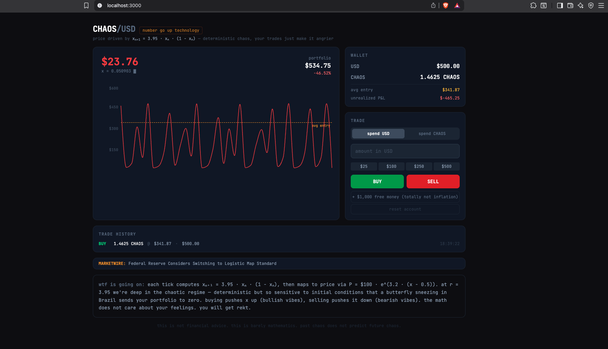

# CHAOS/USD — Logistic Map Market

A chaotic DEX simulator powered by deterministic chaos. The price follows the logistic map: **xₙ₊₁ = 3.95 · xₙ · (1 − xₙ)** — your trades perturb the attractor, but the math always wins.



## How it works

Each tick computes the next value of the logistic map at r = 3.95 (deep chaotic regime), then maps to price via:

**P = $100 · e^(3.2 · (x − 0.5))**

- **Buying** pushes x up → price rises (bullish vibes)
- **Selling** pushes x down → price falls (bearish vibes)
- Random chaos events shake the attractor every few seconds
- Trades persist in localStorage — survive refreshes

## Run locally

```bash
npm install
npm run dev
```

Open [http://localhost:3000](http://localhost:3000)

## Deploy

[](https://vercel.com/new/clone?repository-url=https://github.com/Divyn/chaotic-dex)

## Disclaimer

This is not financial advice. This is barely mathematics. Past chaos does not predict future chaos.
